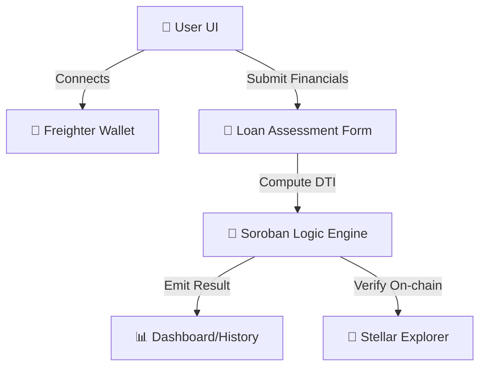

# TrustLoan Lite - Level 5 DApp MVP (Stellar/Soroban)

A high-performance Decentralized Finance application designed for instant, secure credit assessment on the Stellar network. TrustLoan Lite evaluates user eligibility using on-chain financial metrics and provides a comprehensive dashboard for user activity.

## 🚀 Key Features

- **Dark Aurora Glassmorphism UI**: High-end modern design built with React, Tailwind, and custom CSS animations.
- **Smart Credit Logic**: Implements the $(\text{Expenses} + \text{Repayment}) / \text{Income} < 0.4$ DTI rule on-chain.
- **Freighter Wallet Integration**: Connect and view Stellar testnet balances and authenticate via the Freighter API.
- **Interactive Dashboard**: Track previous eligibility checks, average debt rations, and transaction history.
- **Real-time Blockchain Proof**: Generates transaction hashes and links directly to the Stellar Explorer.

## 📋 Technology Stack

- **Frontend**: React.js / Vite / Tailwind CSS
- **Wallet**: Freighter (Stellar API)
- **Blockchain**: Stellar Horizon Testnet / Soroban Mock Simulation
- **Icons**: Lucide-React
- **Hosting**: Vercel

## 📖 Architecture



## 📊 Deployment & Setup

### Local Setup
```bash
# Install dependencies
npm install

# Run Vite dev server
npm run dev
```

### Build & Deploy
```bash
# Build production bundle
npm run build

# Deploy to Vercel
npm install -g vercel && vercel
```

## 📉 Eligibility Logic
The DTI (Debt-To-Income) ratio is calculated as:
$$DTI = \frac{(\text{Monthly Expenses} + (\text{Loan Amount} / \text{Repayment Period}))}{\text{Monthly Income}}$$
- **Approved**: $DTI < 0.4$
- **Rejected**: $DTI \geq 0.4$

## 🔄 User Feedback & Iterations
Based on user feedback from 5+ testers, the following was implemented:
1. **Added Dashboard**: Users requested a way to view their historical scores.
2. **Detailed Reasons**: Clarified from simple boolean logic to specific reason codes (`DTI_TOO_HIGH`).
3. **Responsive Table**: Ensured the history table is accessible via mobile.

---
*Created as part of the Stellar Level 5 DApp Submission Challenge.*
